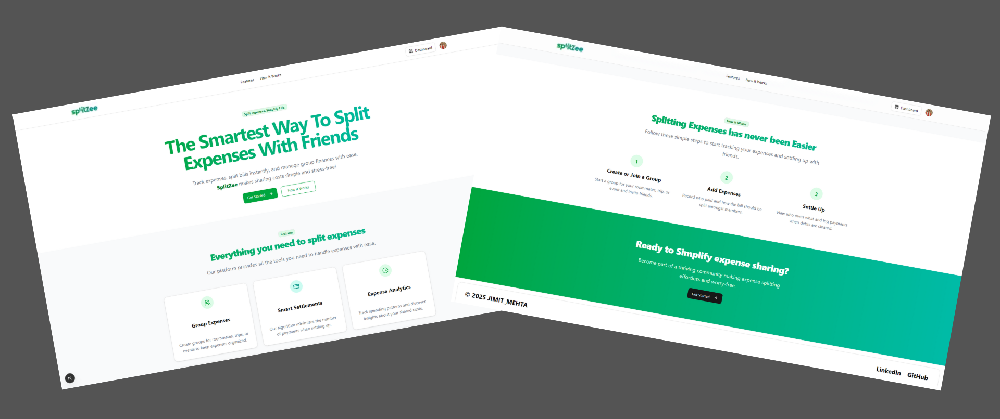
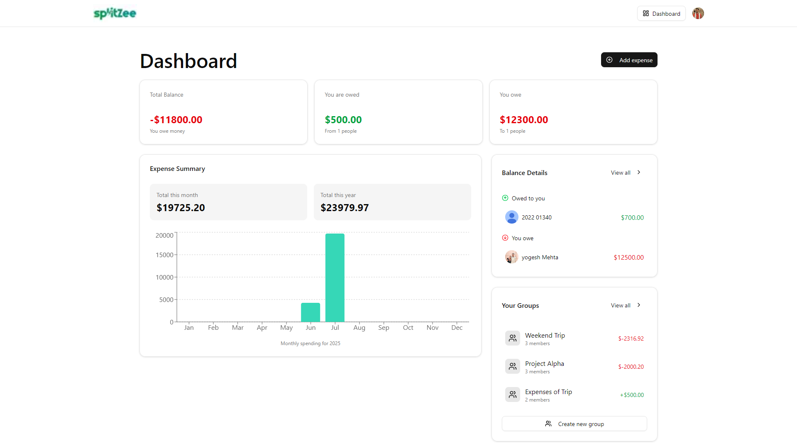
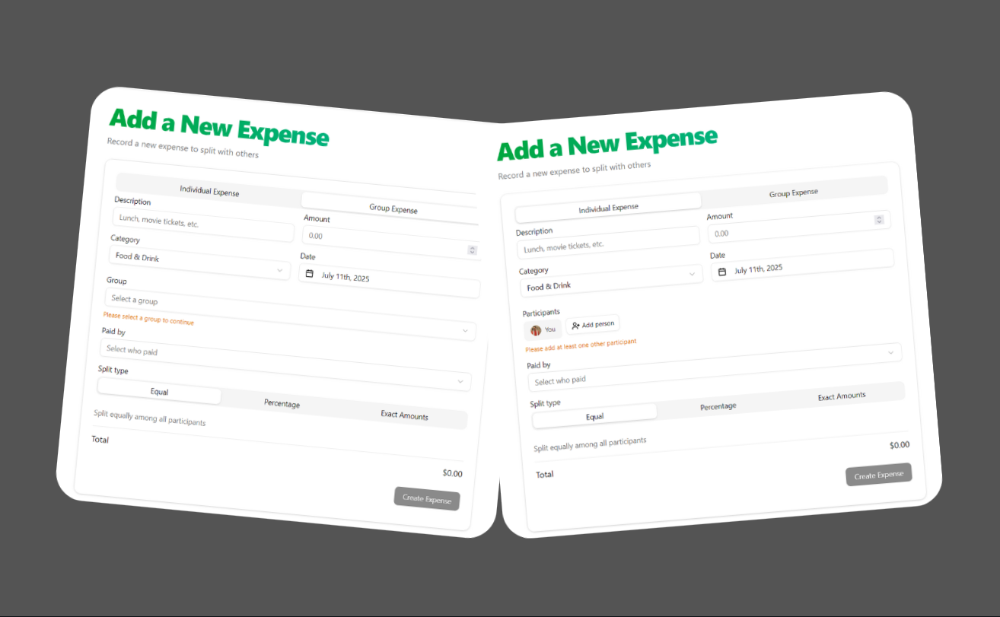
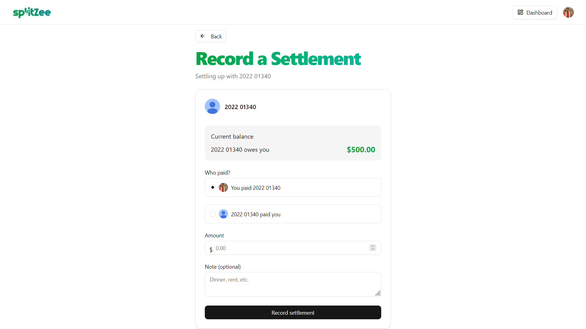

# SplitZee 💰

> **Smart Debt-Simplification and Expense Tracker**

SplitZee is a full-stack expense splitting application that revolutionizes how you manage shared expenses with friends and groups. With intelligent debt simplification, real-time updates, and AI-powered insights, splitting bills has never been easier or smarter.

## 🔗 Links
- [Live Demo](https://splitzee.vercel.app)




## 🌟 Key Features

### 💸 **Smart Expense Splitting**
- **Multiple Split Options**: Equal, percentage-based, or exact custom amounts
- **Individual & Group Expenses**: Handle both personal and group transactions
- **Auto Debt-Simplification**: Calculates the most efficient settlement paths
- **Reduced Transactions**: Minimizes unnecessary payments between friends

### 👥 **Social & Group Management**
- **Group Creation**: Create and manage expense groups
- **Settlement History**: Track all past settlements and payments
- **Multi-User Support**: Handle complex group dynamics

### 📊 **Interactive Dashboard**
- **Monthly Spending Patterns**: Visual spending analysis
- **Balance Overview**: Clear debt and credit summaries
- **Interactive Charts**: Beautiful data visualizations
- **Real-time Updates**: Live synchronization across all users

### 🤖 **AI-Powered Insights**
- **Spending Pattern Analysis**: AI analyzes your expense habits
- **Personalized Insights**: Custom recommendations based on your data
- **Smart Settlement Reminders**: Automated email notifications


### ⚡ **Real-time Experience**
- **Live Updates**: Changes reflect instantly across all devices
- **Real-time Database**: Powered by Convex for instant synchronization
- **Responsive Design**: Perfect experience on all screen sizes

## 🚀 Quick Start

### Prerequisites

- Node.js 18+ 
- npm, yarn, pnpm, or bun
- Git

### Installation

1. **Clone the repository**
   ```bash
   git clone https://github.com/jimit8929/SplitZee.git
   cd SplitZee
   ```

2. **Install dependencies**
   ```bash
   npm install
   # or
   yarn install
   # or
   pnpm install
   # or
   bun install
   ```

3. **Set up environment variables**
   ```bash
   cp .env.example .env.local
   ```
   
   Configure your environment variables:
   ```env
   # Clerk Authentication
   NEXT_PUBLIC_CLERK_PUBLISHABLE_KEY=your_clerk_publishable_key
   CLERK_SECRET_KEY=your_clerk_secret_key
   
   # Convex Database
   CONVEX_DEPLOYMENT=your_convex_deployment_url
   NEXT_PUBLIC_CONVEX_URL=your_convex_url
   
   # Inngest (Background Jobs)
   INNGEST_EVENT_KEY=your_inngest_event_key
   INNGEST_SIGNING_KEY=your_inngest_signing_key
   
   # AI Service (OpenAI/etc.)
   OPENAI_API_KEY=your_openai_api_key
   
   # Email Service
   RESEND_API_KEY=your_resend_api_key
   ```

4. **Set up Convex**
   ```bash
   npx convex dev
   ```

5. **Start the development server**
   ```bash
   npm run dev
   # or
   yarn dev
   # or
   pnpm dev
   # or
   bun dev
   ```

6. **Open your browser**
   Navigate to `http://localhost:3000`

## 🛠️ Tech Stack

### Frontend
- **Framework**: Next.js 15 (App Router)
- **Library**: React.js 19
- **Styling**: TailwindCSS
- **Animations**: GSAP
- **Forms**: React Hook Form + Zod validation


### Backend & Database
- **Database**: Convex (Real-time)
- **Authentication**: Clerk
- **Background Jobs**: Inngest
- **API**: Next.js API Routes

### Features & Integrations
- **AI Analytics**: OpenAI GPT integration
- **Email Service**: Resend/SendGrid
- **Deployment**: Vercel


## 📱 Screenshots

### Dashboard Overview


### Individual & Group Expense Splitting


### Settlement Dashboard



## 🏗️ Project Structure

```
SplitZee/
├── app/                    # Next.js App Router
│   ├── (auth)/            # Authentication pages
│   ├── (dashboard)/       # Main app pages
│   ├── api/               # API routes
│   ├── globals.css        # Global styles
│   └── layout.tsx         # Root layout
├── components/            # Reusable UI components
│   ├── ui/               # Base UI components
│   ├── forms/            # Form components
│   ├── charts/           # Chart components
│   └── layout/           # Layout components
├── convex/               # Convex backend functions
│   ├── schema.ts         # Database schema
│   ├── expenses.ts       # Expense operations
│   ├── groups.ts         # Group management
│   └── settlements.ts    # Settlement logic
├── lib/                  # Utility functions
│   ├── utils.ts          # General utilities
│   ├── validations.ts    # Zod schemas
│   └── ai.ts            # AI integration
├── hooks/                # Custom React hooks
├── types/                # TypeScript definitions
└── public/               # Static assets
```

## 🔧 Configuration

### Clerk Setup
1. Create a Clerk account at [clerk.com](https://clerk.com)
2. Create a new application
3. Configure sign-in/sign-up options
4. Add your keys to `.env.local`

### Convex Setup
1. Create a Convex account at [convex.dev](https://convex.dev)
2. Initialize your project with `npx convex dev`
3. Deploy your schema and functions
4. Copy your deployment URL

### Inngest Setup
1. Create an Inngest account at [inngest.com](https://inngest.com)
2. Create a new project
3. Configure your event and signing keys
4. Set up background job workflows

## 🧪 Development Scripts

```bash
# Development
npm run dev          # Start development server

# Convex
npx convex dev       # Start Convex development
npx convex codegen
npx convex push

# Inngest
npx inngest-cli@latest dev  #
```


## 📄 License

This project is licensed under the MIT License - see the [LICENSE](LICENSE) file for details.


## 📞 Support & Contact

Need help or have questions?

- 📧 **Email**: [jimit8929@gmail.com](mailto:jimit8929@gmail.com)

---

<div align="center">
  <p>Built with ❤️ by <a href="https://github.com/jimit8929">Jimit</a></p>
  <p>⭐ Star this repository if you find it helpful!</p>
  <p><em>Making expense splitting smart, simple, and social.</em></p>
</div>

---

*Split smarter, not harder. Experience the future of expense management with SplitZee!*